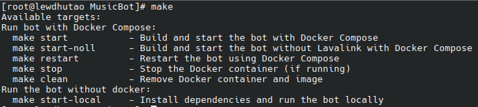

<h1 align="center">Discord Music Bot</h1>

## Features
- Built using Discord.js v14 and Lavalink v4
- Supports Slash Commands, Context Commands, and Prefix Commands
- User-friendly and easy to set up
- 24/7 Music Playback
- Customizable Prefix
- Supports Docker

## Supported Sources

       

### Required Plugins

Note: If you use Lavalink Docker, LavaSrc and Youtube-Source Plugins are already installed. You just need to set up in [`lavalink/application.yml`](./lavalink/application.yml)

  

## Requirements
- Node Version v18.x or higher
- Lavalink v4
- MongoDB (You can set up a free MongoDB server [here](https://www.mongodb.com/))

## Installation

You can run this bot with or without Docker. For an easy setup, use the `make` command. If `make` is not available, use `run.sh`. Ensure Docker is installed on your machine to use the bot with Docker.

Looking for a more involved guide on how to install this bot? Use the [installation guide](https://phonic.lol).

### Using Make

### Without Make

- Before using `./run.sh`, make sure to run `chmod +x ./run.sh`.

#### Before you start the bot, ensure you have filled out everything in [`src/config.js`](./src/config.js).

### Command Usage (Docker)

1. **make start** or **./run.sh start**: Starts the bot with Lavalink using Docker Compose.

2. **make start-noll** or **./run.sh start-noll**: Starts the bot without Lavalink using Docker Compose.

3. **make restart** or **./run.sh restart**: Restarts the bot.

4. **make stop** or **./run.sh stop**: Stops the bot.

5. **make clean** or **./run.sh clean**: Removes Docker containers.

### Command Usage (Without Docker)

1. **make start-local** or **./run.sh start local**: Starts the bot locally on your machine without Docker Compose.

Note: If you use a VPS and start the bot without Docker, make sure to use `pm2` to keep the bot online 24/7.

 

## Preview

## LICENSE

This project is licensed under the ISC License. You are free to use the music bot for any purpose, including making it public or verifying the bot.
